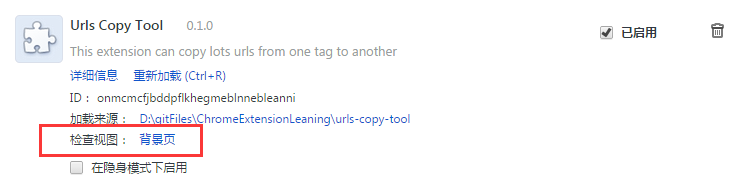

#Google Chrome Extension 学习

##参考资料
1. [官方文档](https://developer.chrome.com/extensions)
1. [360翻译的带有广告性质的官方文档](http://open.chrome.360.cn/extension_dev/overview.html)

##学到的东东

###mainifest.json
1. `manifest_version": 2`，用整数表示manifest文件自身格式的版本号。现在已强制必须为2。

###popup.js
1. Most methods of the Chrome extension APIs are asynchronous.（Chrome extension的大多数API都是异步的）

### 

通过这东西，用console.log等语句调试拓展程序。

##官方学习资料

1. [ Manifest File Format ](https://developer.chrome.com/extensions/manifest)

##自己做的插件 
1. urls-copy-tool

